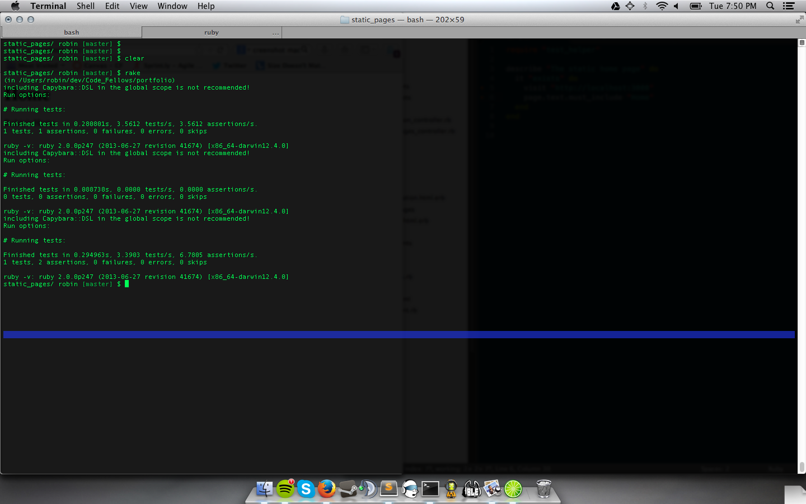

Robin J. Swenson-Healey
=======================
Dynamic Rails Portfolio App
---------------------------
By [Robin](http://github.com/rjswenson)

[Code Fellow](http://www.codefellows.org)

Description
===========

This portfolio is written in Ruby on Rails.  It will be interactive
and functional by the end of *Code Fellows Boot Camp*.

Screenshots
===========

Day 2 - Static_Page Controller for home page set

Version
-------
0.1 - polymorphic comments, Devise protections, OAuth Twitter on posts/projects

0.2 - markdown within post body

Created
-------
October, 2013
